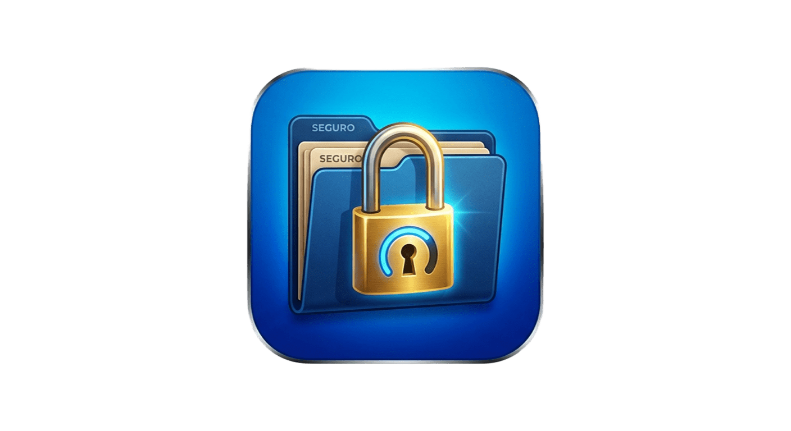

# SecureFolder

Carpeta cifrada con contraseña para Windows. Crea contenedores cifrados (`.sfv`) que se montan como unidades virtuales transparentes.

<p align="center">
  
</p>

## Características

- **Cifrado AES-256-GCM** con autenticación (nonce 12B + tag 16B)
- **Argon2id** para derivación de clave (64 MB / 3 iteraciones / 4 paralelo)
- **AES-256-KW** (RFC 3394) para envolver el DEK — permite cambio de contraseña sin re-cifrar
- **Unidad virtual transparente** con WinFsp — se abre como cualquier letra de unidad
- **100% offline** — sin conexión a internet, sin servicios externos
- **Tray icon** — se minimiza a la bandeja del sistema
- **Auto-lock** por inactividad o al apagar Windows

## Requisitos

- Windows 10/11 (x64)
- [WinFsp](https://winfsp.dev/rel/) — se instala automáticamente con el instalador

## Instalación

### Con el instalador (recomendado)

1. Descargar `SecureFolderSetup.exe` desde [Releases](https://github.com/FabianGallardo-coder/SecureFolder/releases)
2. Ejecutar el instalador (requiere permisos de administrador para instalar WinFsp)
3. Abrir SecureFolder desde el acceso directo o el menú Inicio

### Build desde código fuente

```powershell
# Restaurar y compilar
dotnet build -c Release

# Ejecutar tests
dotnet test

# Publicar self-contained
.\build.ps1
```

## Uso

1. **Crear vault**: hacer clic en "+ Crear carpeta segura", elegir nombre, ubicación y contraseña
2. **Desbloquear**: hacer clic en "Desbloquear" e ingresar la contraseña — se monta como unidad virtual
3. **Usar**: copiar/crear archivos normalmente en la unidad montada
4. **Bloquear**: hacer clic en "Bloquear" — los datos se cifran y la unidad se desmonta

> ⚠ Si olvidás la contraseña, los datos cifrados pueden ser irrecuperables.

### Limitaciones conocidas

- **Las carpetas vacías no se conservan**: el índice del vault solo guarda archivos. Si creás una
  carpeta y la dejás vacía, al bloquear/desbloquear la carpeta desaparece (persisten los archivos y
  las carpetas que contengan archivos).

## Arquitectura

```
SecureFolder.App          WPF UI + tray icon (net10.0-windows)
  └─ SecureFolder.Core    Criptografía + filesystem virtual
       ├─ Crypto/         AesGcmEngine, Argon2Kdf, KeyWrapper (RFC 3394)
       ├─ Filesystem/     SecureFolderFileSystem (WinFsp FileSystemBase)
       └─ Vault/          VaultFormat (.sfv), VaultManager, HmacHelper
```

### Formato del vault (`.sfv`)

| Offset | Tamaño | Campo |
|--------|--------|-------|
| 0 | 4 | Magic `SFVL` |
| 4 | 2 | Versión (uint16 LE) |
| 6 | 16 | Salt (Argon2id) |
| 22 | 12 | Parámetros KDF (memorySize + iterations + parallelism) |
| 34 | 40 | DEK envuelto (AES-256-KW, RFC 3394) |
| 74 | 32 | Blob de verificación (nonce + ciphertext + tag) |
| 106 | 32 | HMAC-SHA256 del header |
| 138 | 4 | Tamaño del índice cifrado |
| 142 | N | Índice cifrado (AES-256-GCM, JSON) |
| 142+N | ... | Bloques de datos cifrados (chunks de 64 KB) |

## Tecnologías

- [.NET 10](https://dotnet.microsoft.com/) + WPF
- [winfsp.net](https://github.com/winfsp/winfsp) — filesystem virtual
- [Konscious.Security.Cryptography.Argon2](https://github.com/konscious.net/argon2) — KDF
- [CommunityToolkit.Mvvm](https://github.com/CommunityToolkit/CommunityToolkit) — MVVM
- [H.NotifyIcon.Wpf](https://github.com/HavenDV/H.NotifyIcon) — tray icon

## Licencia

[MIT](LICENSE) — Ver también la [licencia de WinFsp](https://github.com/winfsp/winfsp/blob/master/LICENSE.TXT) (GPLv3 con excepción FLOSS).
